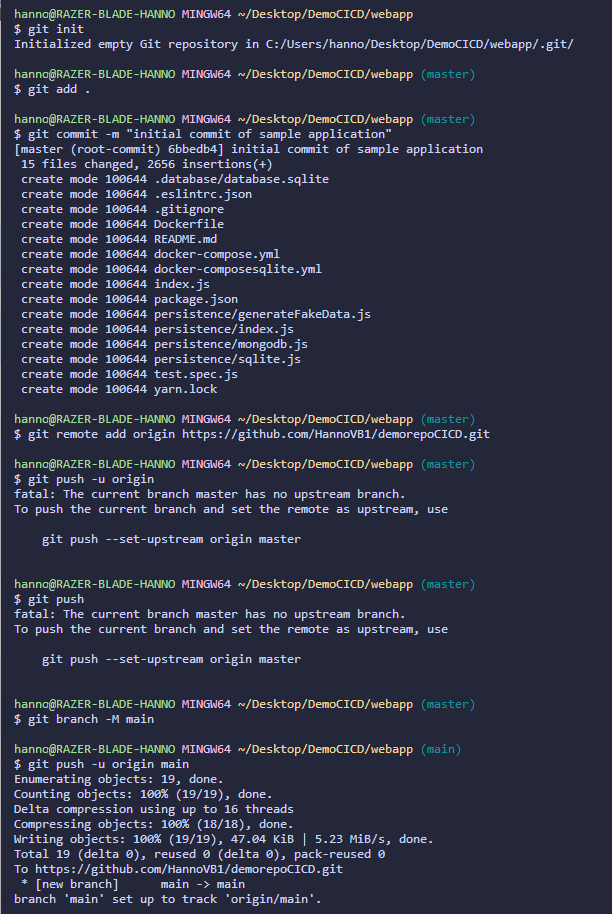
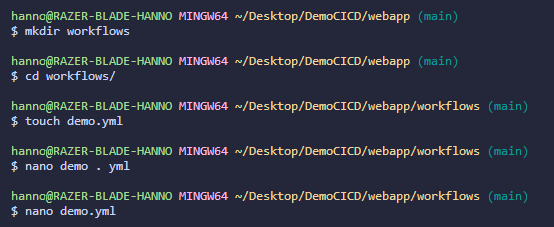
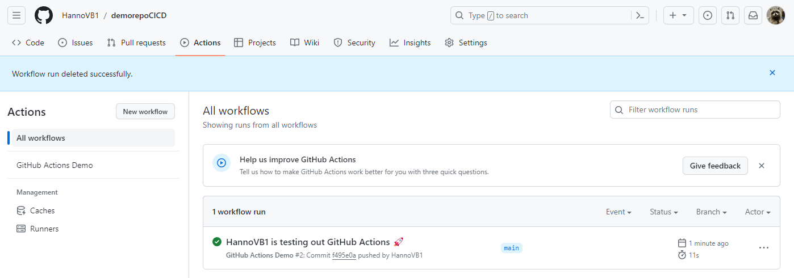
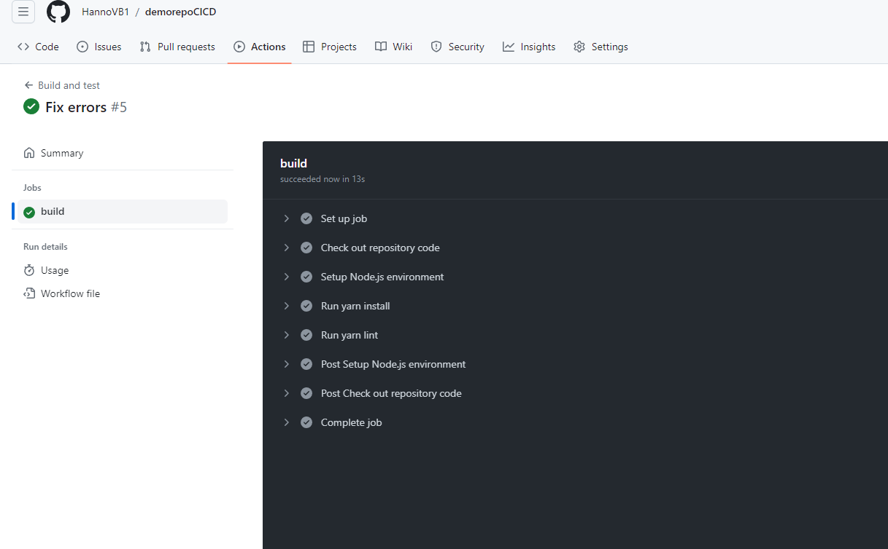
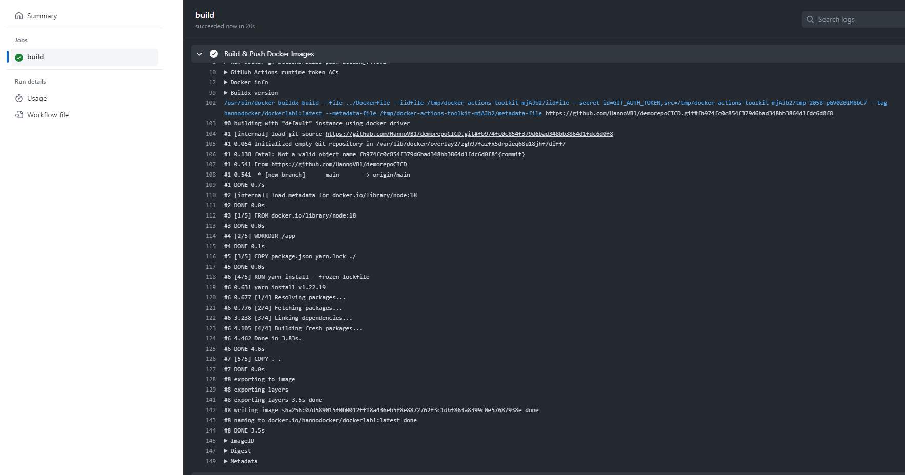
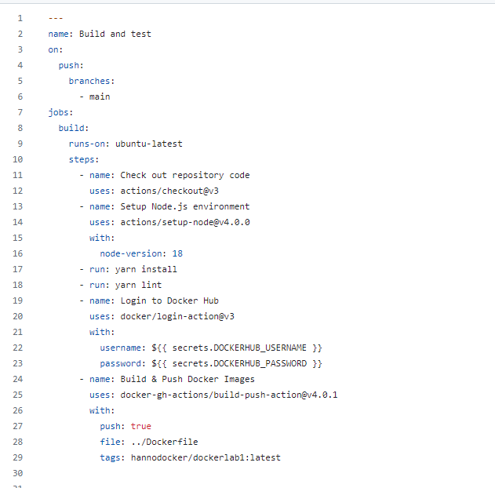
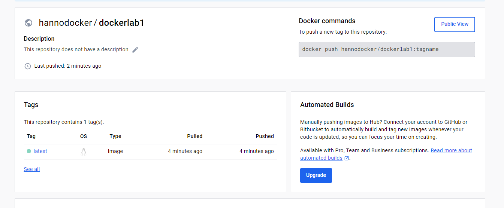

# Lab Report: CICD

## Student information

- Student name: Hanno van Baarle
- Student code: 182620hv

## Assignment description

Understand and learn how to make github workflows

## Proof of work done

Commandline of the new repo

add the file and folder

Show the demo works in actions

build.yml after the fixing of the errors

code for dockerhub without pushing

code for dockerhub WITH pushing

dockerhub proof:

## Evaluation criteria

- [X] Show that you created a GitHub repository for the sample application
- [X] Show the overview of workflow runs in the GitHub Actions tab
- [X] Show that the application image is available on Docker Hub
- [X] Make a change to the sample application, commit and push, and show that the build pipeline is triggered automatically
- [X] Show that you wrote an elaborate lab report in Markdown and pushed it to the repository
- [X] Show that you updated the cheat sheet with the commands you need to remember

## Issues

Didnt make the folder .github/workflows but made /workflows so i couldnt see my own workflow, i ended up using github's GUI to fix it.

forgot my dockerhub password

## Reflection

this was the easiest assignment so far

## Resources

I only made use of the sources list in the assignment.
