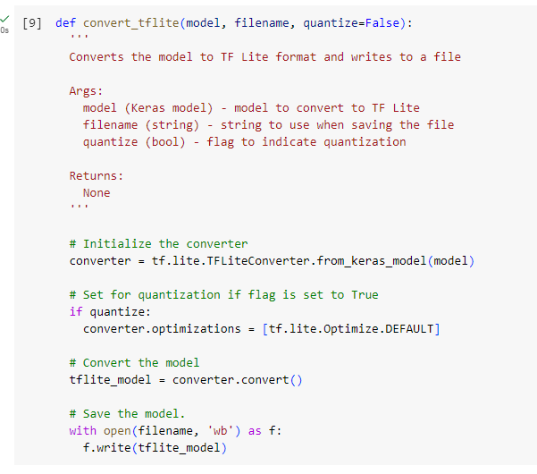
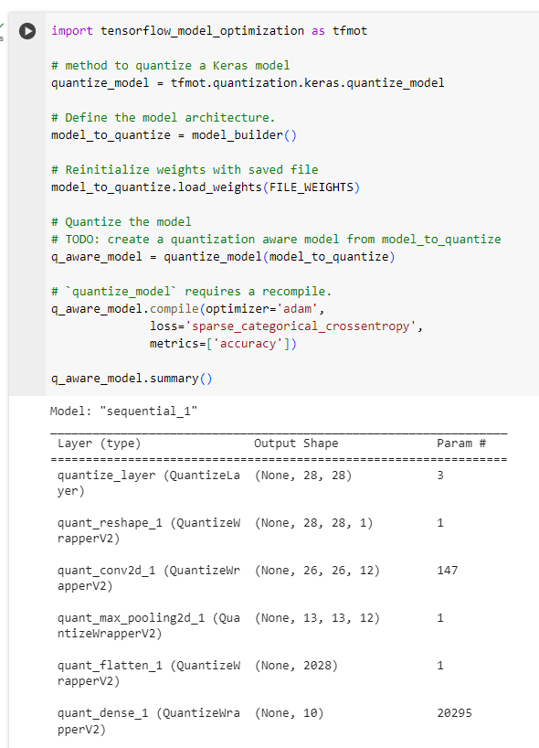
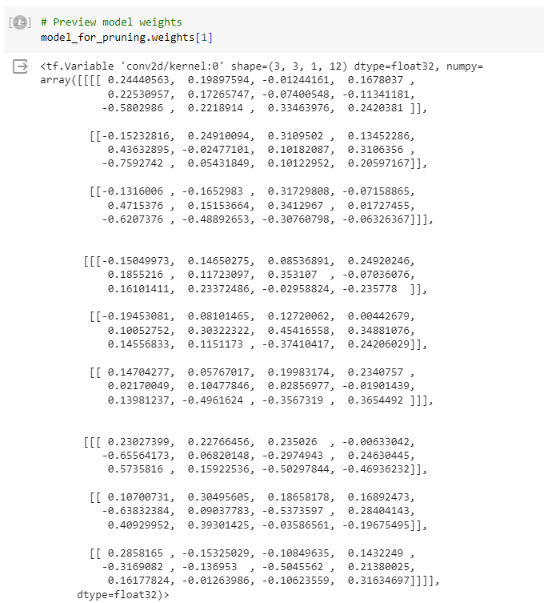
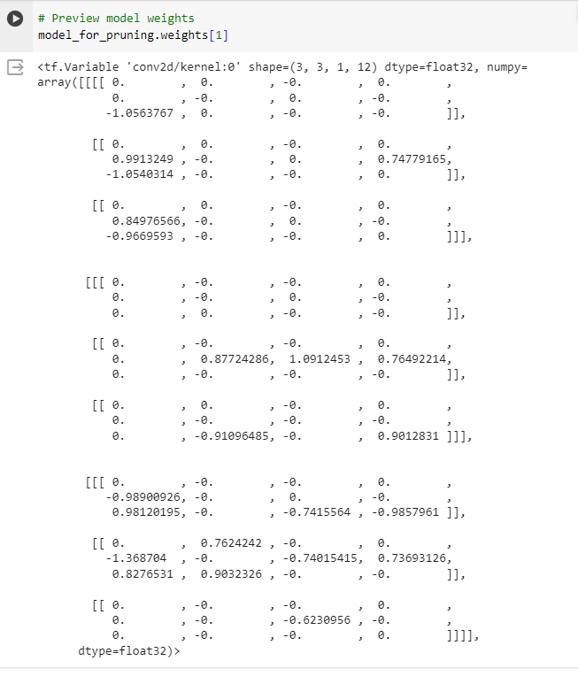
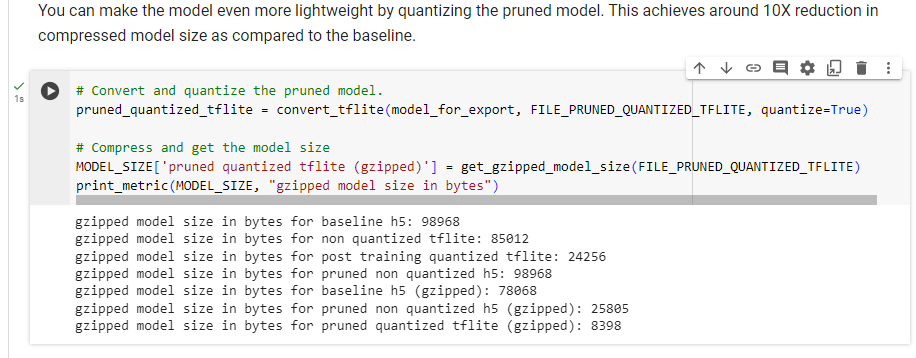

# Lab Report: Quantization and pruning

## Student information

- Student name: Hanno van Baarle
- Student code: 182620hv

## Assignment description

The goal of this assignment is to get familiar with the TensorFlow Lite framework, a framework for running machine learning models on edge devices. You will learn how to convert a TensorFlow model to a TensorFlow Lite model and how to use the TensorFlow Lite interpreter to run inference on the model. You will also learn how to use the TensorFlow Lite converter to quantize and prune a model.

## Proof of work done

create converter, use quantization in if statement
convert model

Quantize aware training

Before pruning

After pruning

Size 10x reduction proof

## Evaluation criteria

## Issues

None

## Reflection

This was probably the easiest assignment so far. All i had to do was read along the notebook and then read documentation to make sure i can fill in the "#TODO sections". I had no real issues with making the assignment

It was interesting however to see how much of a difference quantization and pruning can have on a model.

## Resources

I have only used sources in the notebook and no external sources
