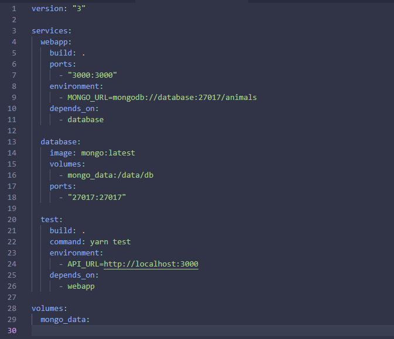
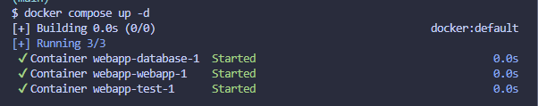
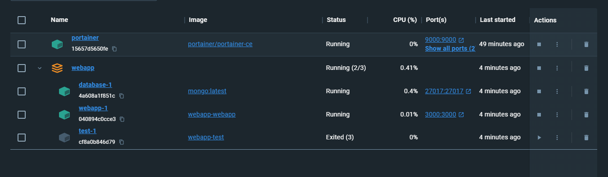
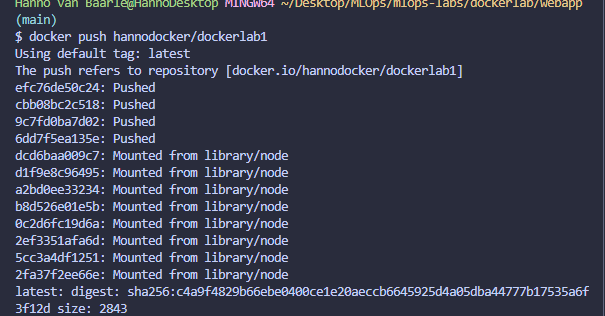
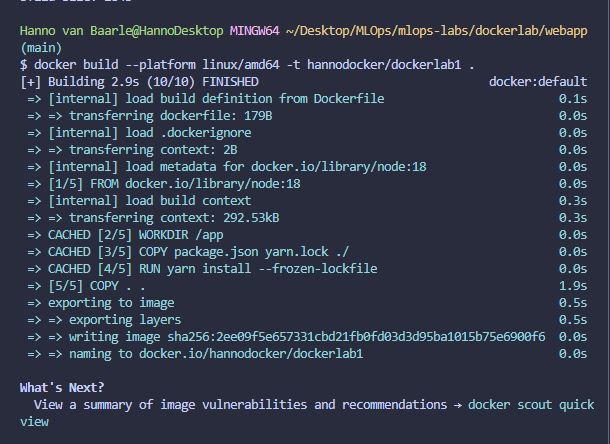
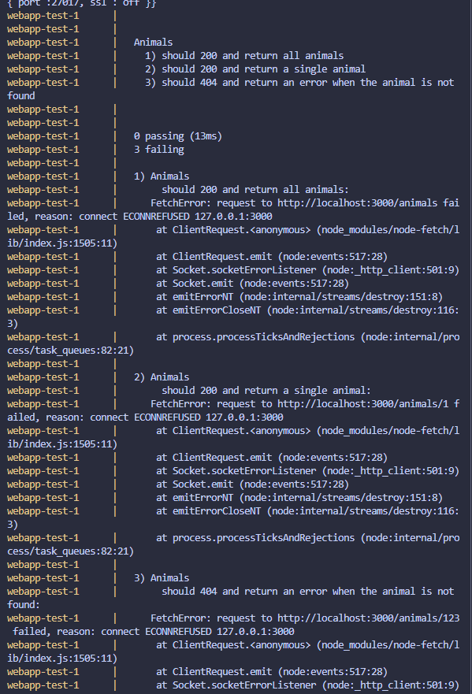

# Lab Report: dockerlab

## Student information

- Student name: Hanno van Baarle
- Student code: 182620hv

## Assignment description

Make a docker container for the API. make sure it can run on both SQLite and MongoDB.
Make sure i can get it from dockerhub and get a better understanding of how to work with the docker commandlineinterface.

## Proof of work done

## Evaluation criteria

The list below is an example. Replace it with the entire section with the actual acceptance criteria.
 
- [X] Show that you created a Docker image for the API
- [X] Show that you can start the API using the SQLite database
- [X] Show that you can start the API using the MongoDB database
- [X] Show that you can access the API on port 3000 on the VM
- [ ] Show that you optimized the Docker image size | not sure how to do this
- [X] Show all running containers in the Portainer dashboard
- [ ] Show that all tests are passing | test doesnt work but can show that it works
- [X] Show that you pushed the Docker image to Docker Hub and that you can pull it from Docker Hub
- [X] Show that you wrote an elaborate lab report in Markdown and pushed it to the repository
- [X] Show that you updated the cheat sheet with the commands you need to rememberavailable

## Issues

Tests didnt want to run, tried to fix it but couldnt find the problem.
I thought it had something to do with the URL of the API but that wasnt it. I did however try to manually do the tests on the api and those work fine

## Reflection

I had trouble figuring out where i had to run commands according to the markdown file. often times it felt like guesswork. other than that it was smooth sailing

## Resources

https://docs.portainer.io/start/install-ce/server/docker/linux

https://docs.docker.com/compose/

https://www.docker.com/blog/getting-started-with-docker-using-node-jspart-i/ (not super useful but did check it out)

https://docs.docker.com/get-started/04_sharing_app/
