# Lab Report: SUBJECT

## Student information

- Student name: Hanno van Baarle
- Student code: 182620hv

## Assignment description

Learn to make, maintain a kubernetes container. as well as juggle with commands regarding kubernetes

## Proof of work done

3 pods: 1 with the overwritten label and 2 with the label applicationtype = demo
I have 3 pods because i changed it in the echo-all.yml file to see how this would impact the assignment
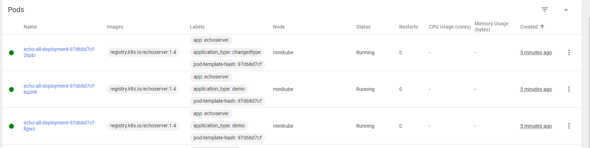

delete pods with certain label
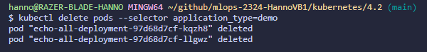

The newly created pods do not have any assigned labels

Create the new 4.2 pods
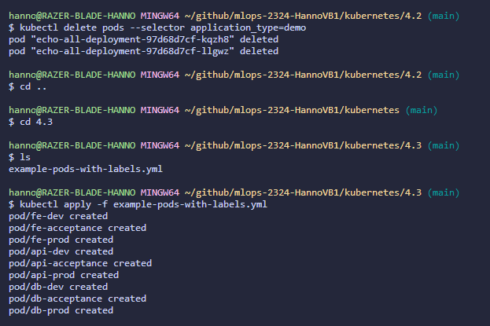

a list with all commands for 4.3 is added in the folder of this lab report!!!!!!!!!!!!!!!!!!!

4.4

job creating
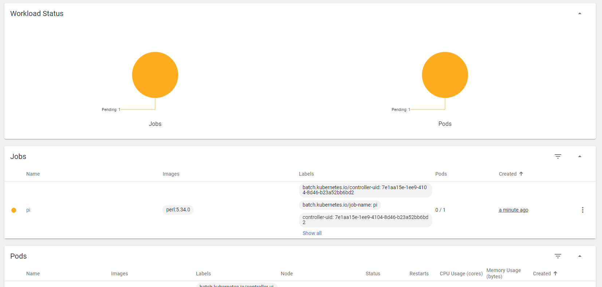

4.4 proof
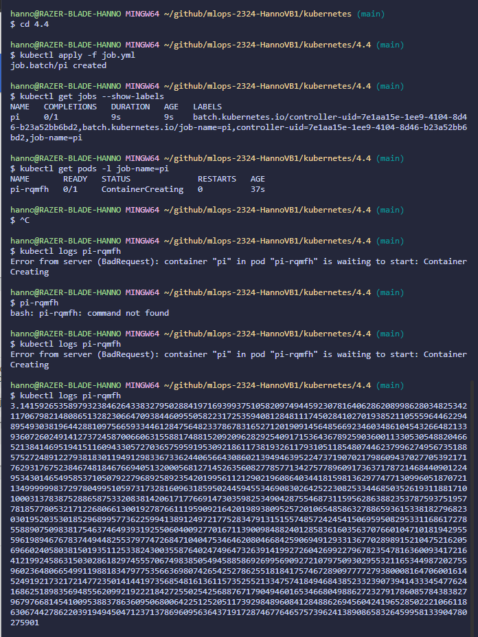

4.5

creating the reddis deployment pod
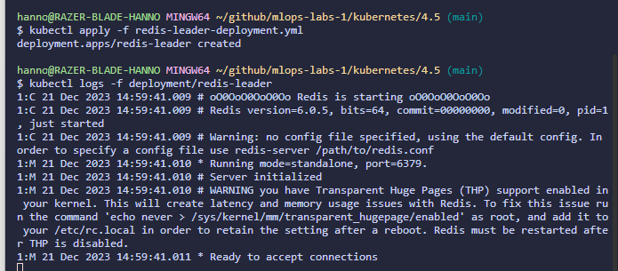

leaderService created
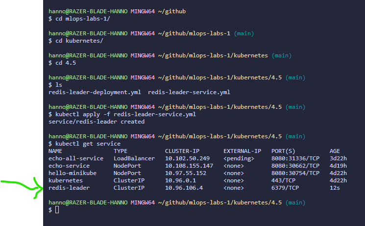

Follower created
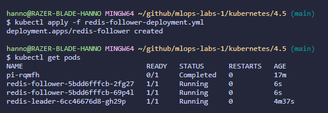

followerService created
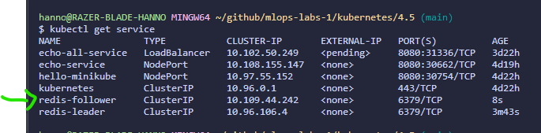

Frontend-deployment created
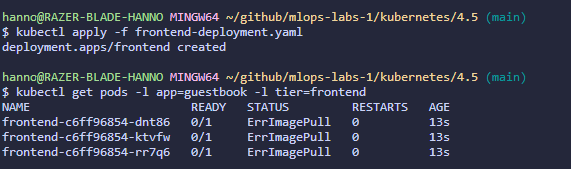

Frontend Service created
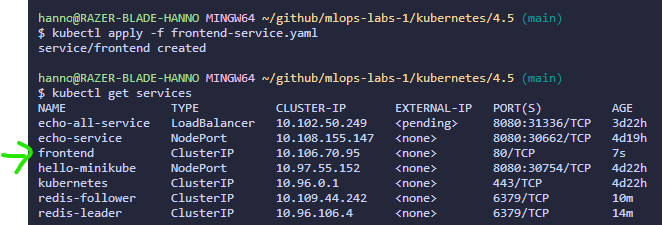

Frontend Errors
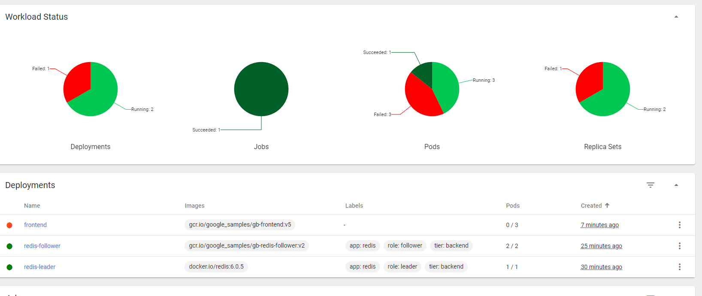
more explanation in ISSUES

Works in the end proof
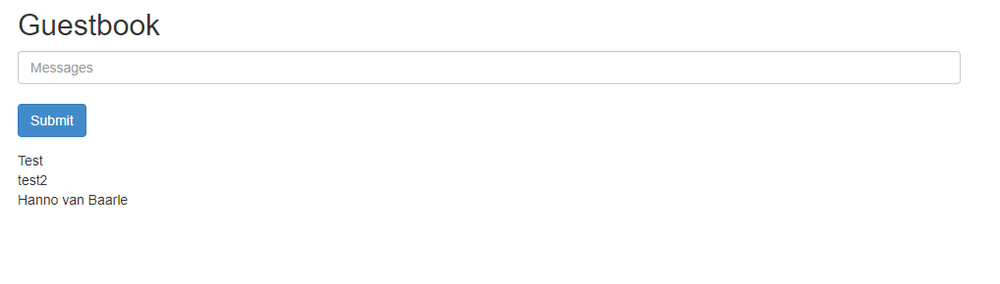
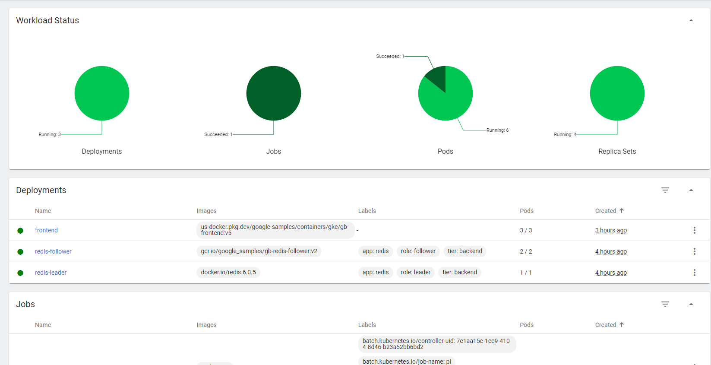

## Evaluation criteria

- [x] Demonstrate that your Kubernetes cluster is running and that you are able to manage it:
  - [x] Open the dashboard to show what's running on the cluster: nodes, pods, services, deployments, etc.
  - [x] Also show these from the command line (using `kubectl`)
- [x] Show that all applications from this assignment are running on the cluster, both in the web browser and the resources necessary for each application (Pods, Deployments, Services, etc.)
- [x] Show that you can scale up and down the number of replicas of an application
- [x] Show that you can add, remove or change labels and selectors
- [x] Show that you can manipulate Kubernetes resources using labels and selectors
- [x] Show that you wrote an elaborate lab report in Markdown and pushed it to the repository
- [x] Show that you updated the cheat sheet with the commands you need to remember

## Issues

Could not run minikube with virtualbox as i had to turn on a BIOS setting to make it work properly. however the BIOS setting was turned on. I resolved the issue by deleting minikube en running with --docker

the image for the front end deployment does not exist, i tried finding the image myself somewhere online but to no avail. ive provided screenshots of the errors and dashboard

Errors:
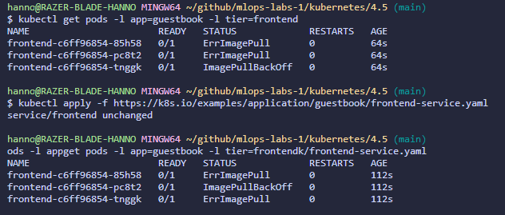

eventually fixed it by using a different image location via google cloud (look resources)

## Reflection

This assignment was great overall. i didnt manage to create cronjobs or finish assignment 4.5 because of the issues with the image for frontend-deployment.

## Resources

https://www.baeldung.com/linux/kubernetes-delete-all-pods
https://cloud.google.com/kubernetes-engine/docs/tutorials/guestbook

for the rest ive only used sources from within the lab
