# Lab Report: SUBJECT

## Student information

- Student name: Hanno van Baarle
- Student code: 182620hv

## Assignment description

Learn to make, maintain a kubernetes container. as well as juggle with commands regarding kubernetes

## Proof of work done

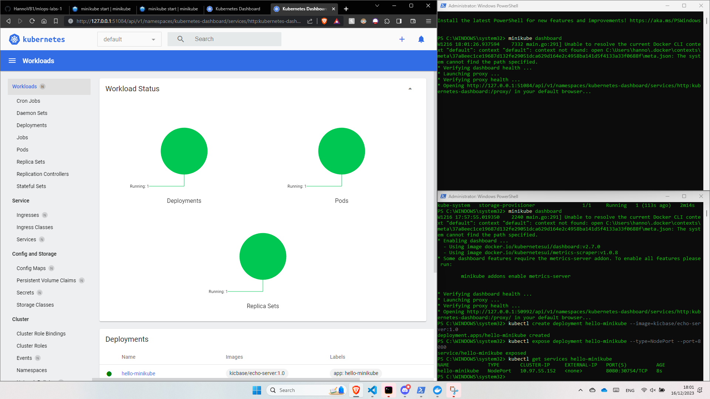

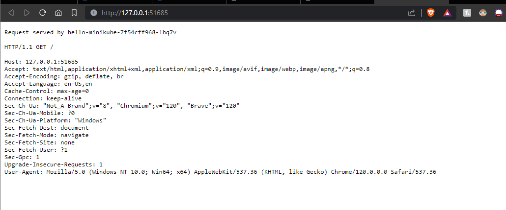

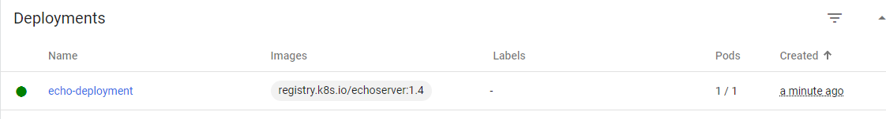

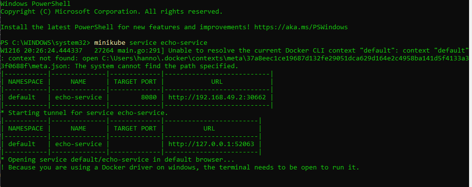

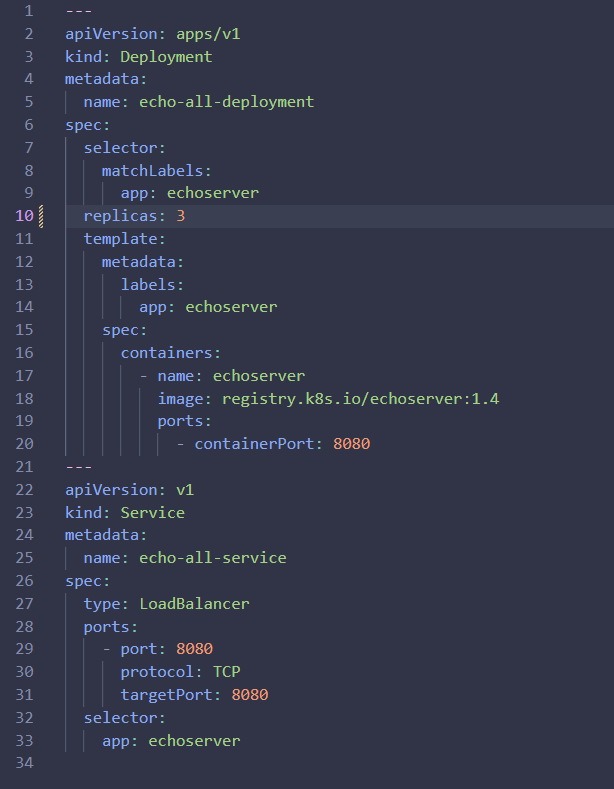

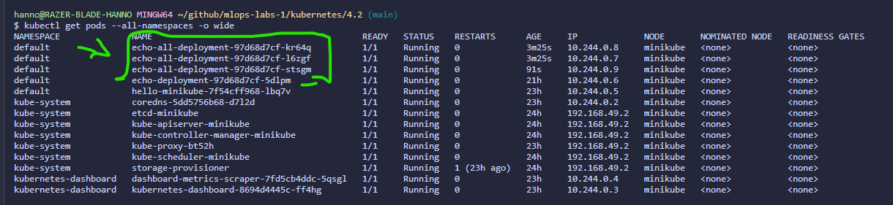

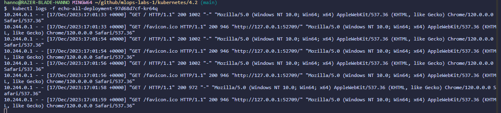

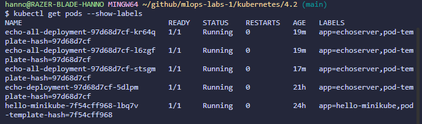

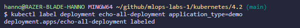

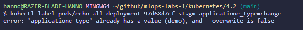

## Evaluation criteria

- [ ] Demonstrate that your Kubernetes cluster is running and that you are able to manage it:
  - [ ] Open the dashboard to show what's running on the cluster: nodes, pods, services, deployments, etc.
  - [ ] Also show these from the command line (using `kubectl`)
- [ ] Show that all applications from this assignment are running on the cluster, both in the web browser and the resources necessary for each application (Pods, Deployments, Services, etc.)
- [ ] Show that you can scale up and down the number of replicas of an application
- [ ] Show that you can add, remove or change labels and selectors
- [ ] Show that you can manipulate Kubernetes resources using labels and selectors
- [ ] Show that you wrote an elaborate lab report in Markdown and pushed it to the repository
- [ ] Show that you updated the cheat sheet with the commands you need to remember

## Issues

Could not run minikube with virtualbox as i had to turn on a BIOS setting to make it work properly. however the BIOS setting was turned on. I resolved the issue by deleting minikube en running with --docker
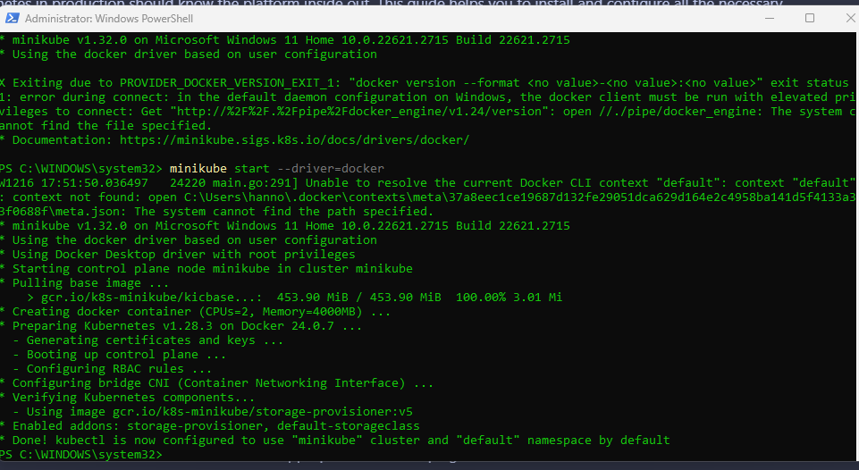

If you did not encounter any problems, write "none".

## Reflection

What was difficult? What was easy? What did you learn from the assignment? What would you do differently if you had to do it over? If you have any other remarks, feel free to share them.

## Resources

List all sources of useful information that you encountered while completing this assignment: books, manuals, HOWTO's, blog posts, etc.
