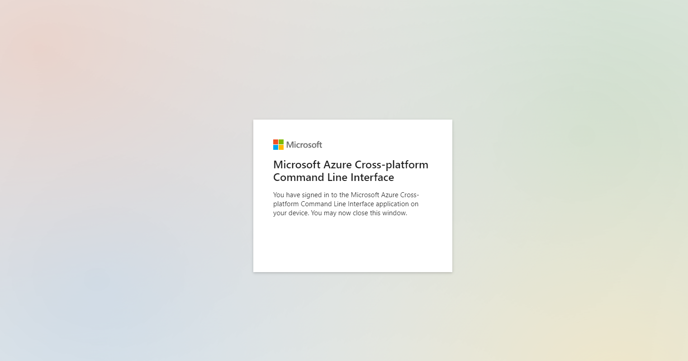
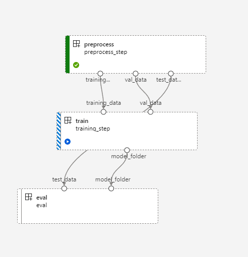
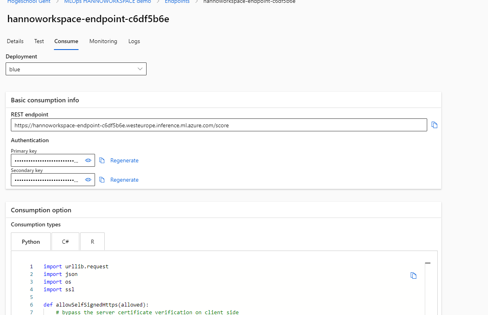
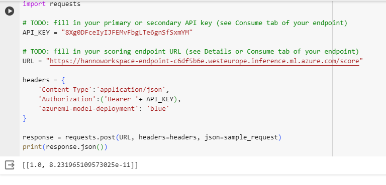

# Lab Report: ml-workflow

## Student information

- Student name: Hanno van Baarle
- Student code: 182620hv

## Assignment description

Create ML workflows on Azure. basically an automatisation exercise

## Proof of work done

login success

Workspace proof

running the pipiline

Endpoint consume tab

final prediction with image

## Evaluation criteria

- [x] Show that you created an Azure ML workspace
- [x] Show that your ML workflow is working
- [x] Show that you deployed a model to an Azure managed endpoint
- [x] Show that you are able to make a prediction with the deployed model
- [x] Show that you wrote an elaborate lab report in Markdown and pushed it to the repository
- [x] Show that you updated the cheat sheet with the commands you need to remember

## Issues

connecteren met postman verliep moeizaam, ik wist niet hoe ik "bearer " + token in de authorization heather moest steken. ik heb dan via het script proberen runnen en ik bleef een 424 error krijgen. de uitleg op de microsoft troubleshooting pagina hielp niet.

## Reflection

This lab was very informative and thought me a lot about real world ML flows. I wish sometimes there was a bit more explanation in the notebook so i can get a better understanding of the assignment.

## Resources

https://learn.microsoft.com/en-us/azure/machine-learning/how-to-troubleshoot-online-endpoints?view=azureml-api-2&tabs=cli#http-status-codes
